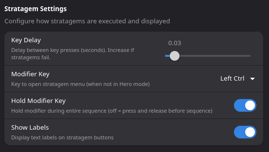

# HELLDIVERS 2 StreamController Plugin

Assumes the following:
* Left Control will open Stratagem menu (Hold/Press)
* Stratagem Directions have been remapped to arrow keys (Up, Down, Left, Right)

## For Users

Simply install the plugin from the StreamController store and configure your Stream Deck buttons with your favorite stratagems.

### Plugin Settings

Access settings via **Settings → Plugins → HELLDIVERS 2 → ⚙️**



| Setting | Description | Default |
|---------|-------------|---------|
| **Key Delay** | Delay between key presses. Increase if stratagems fail to register. | 0.03s |
| **Modifier Key** | Key to open stratagem menu (Left/Right Ctrl, Alt, or Shift) | Left Ctrl |
| **Hold Modifier Key** | Hold modifier during sequence vs press-and-release | ON |
| **Show Labels** | Display text labels on buttons (OFF for icon-only look) | ON |

## For Developers

### Project Structure

```
net_jslay_helldivers_2/
├── main.py                    # Plugin entry point
├── manifest.json              # Plugin metadata
├── VERSION                    # Version number
├── assets/
│   ├── data/
│   │   └── stratagems.json    # Stratagem key sequences (generated)
│   └── icons/
│       └── *.png              # Stratagem icons (generated)
├── locales/
│   └── en_US.json             # Locale strings (generated)
└── update/                    # Asset generation module
    ├── config.py              # Stratagem mappings (source of truth)
    ├── cli.py                 # CLI commands
    └── ...
```

### Update Module

The `update/` module automates asset generation. It scrapes stratagem data from the wiki, downloads SVG icons, and generates all required files.

#### Setup

```bash
# From the plugin directory
pip install -r update/requirements.txt
```

#### Workflow: Adding New Stratagems

When new stratagems are added to the game:

**1. Discover new stratagems**

```bash
cd /path/to/net_jslay_helldivers_2
PYTHONPATH=/path/to/venv/lib/python3.x/site-packages:. python -m update discover
```

This compares wiki.gg and the SVG repository against `config.py` and shows:
- New stratagems found on wiki
- New SVG icons without mappings
- Suggested config entries to add

**2. Update config.py**

Copy the suggested mappings from the discover output and add them to `update/config.py`:

```python
STRATAGEM_MAPPINGS = {
    # ... existing entries ...
    
    # Add new entries:
    "NewStratagem": {"wiki": "Wiki Name", "svg": "SVG Name", "name": "Display Name"},
}
```

The mapping fields:
- **key**: Internal plugin key (used in action IDs, icon filenames, locale keys)
- **wiki**: Exact name as it appears on helldivers.wiki.gg (for scraping sequences)
- **svg**: Exact name as it appears in the SVG repository (for icon generation)
- **name**: Human-readable display name (for locale strings)

**3. Generate assets**

```bash
# Dry run first to preview
python -m update generate-all --dry-run

# Generate everything
python -m update generate-all
```

This generates:
- `assets/data/stratagems.json` - Key sequences from wiki
- `locales/en_US.json` - Locale strings with labels
- `assets/icons/*.png` - Icons from SVGs with corner borders

#### Available Commands

```bash
python -m update discover      # Find new stratagems from wiki/SVGs
python -m update generate-all  # Generate all assets
python -m update icons         # Generate only icons
python -m update locales       # Generate only locale file
python -m update stratagems    # Generate only stratagems.json
python -m update validate      # Validate current configuration
python -m update list          # List all mapped stratagems
```

Add `--dry-run` to any command to preview without writing files.
Add `--verbose` for detailed output.

### Manual Contribution (Legacy)

If you prefer to add stratagems manually:

1. Add a new key to `assets/data/stratagems.json` with the key combination
2. Add icon with matching `keyname.png` to `assets/icons`
3. Add matching `actions.keyname.name` to `locales/en_US.json`
4. Add matching `actions.keyname.labels.*` to `locales/en_US.json`

### TODO

* Add "custom button" option where a user can define the stratagem itself
* Package the icon set
* Test all the buttons
